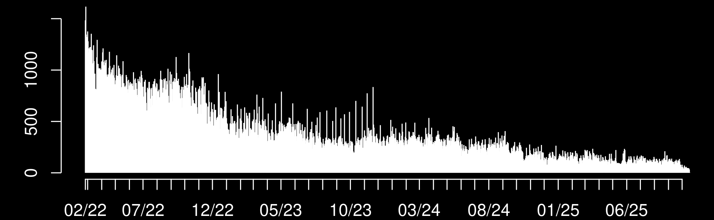
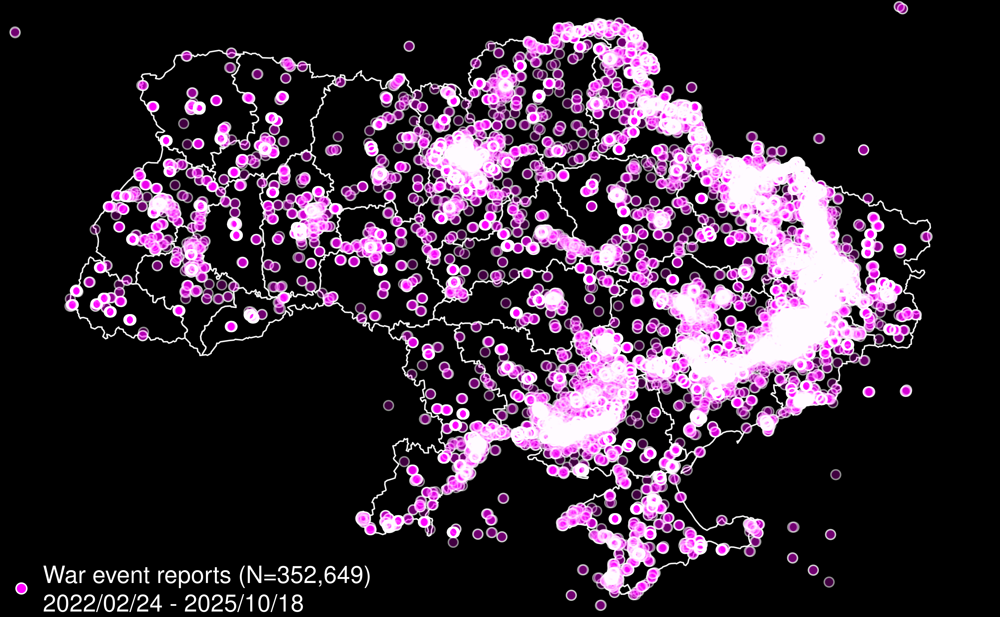
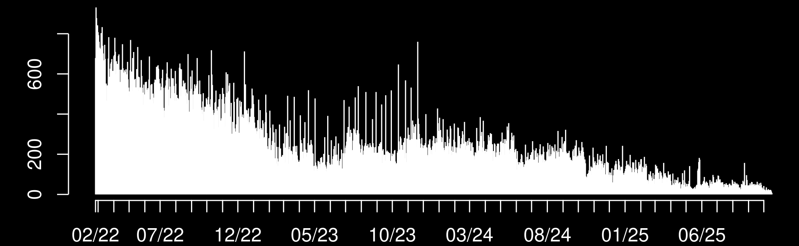
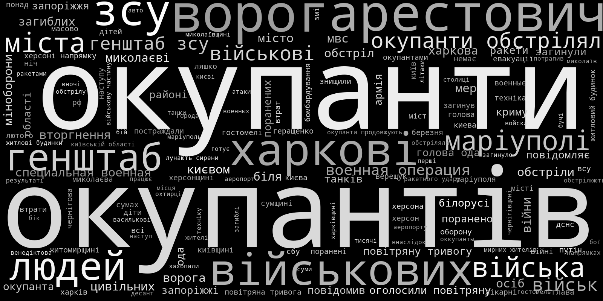
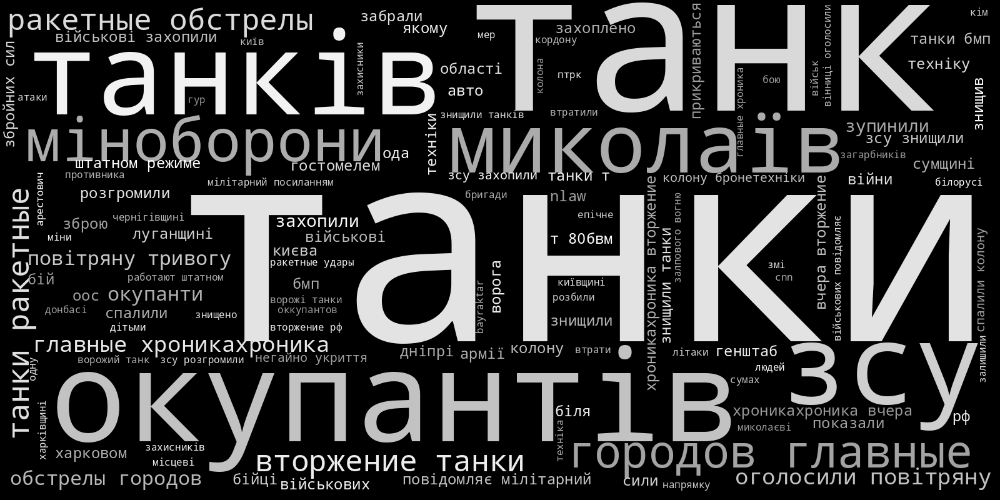
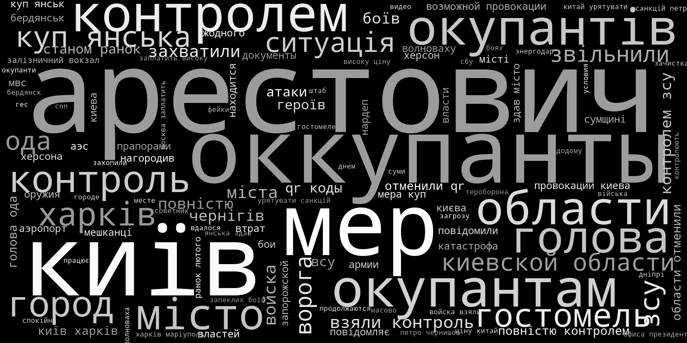
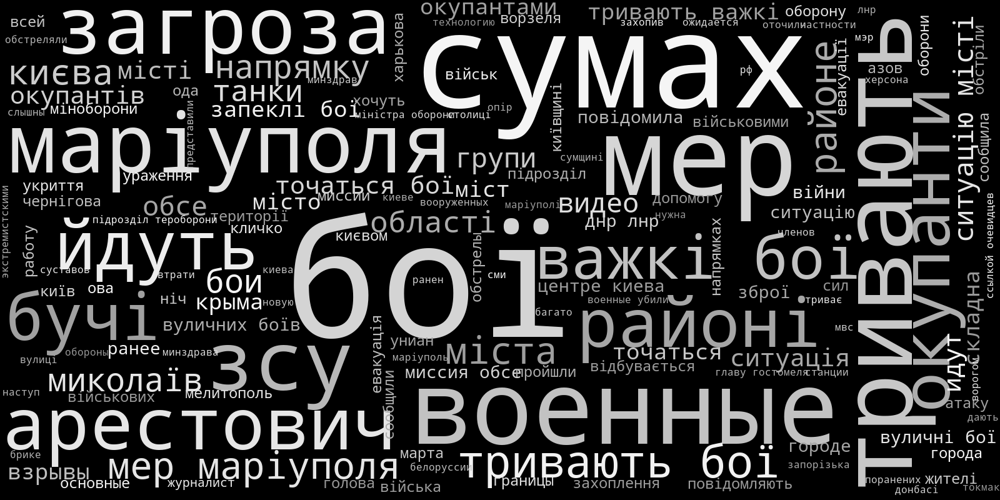
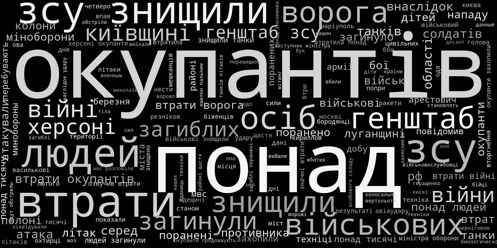

# ВІЙНА.ВОЙНА.VIINA
## VIINA / Violent Incident Information from News Articles on the 2022 Russian Invasion of Ukraine

This is a near-real time multi-source event data system for the 2022 Russian Invasion of Ukraine. These data are based on news reports from Ukrainian and Russian media, which were geocoded and classified into standard conflict event categories through machine learning. 

The most recent version of the data is available as a comma-delimited-text (csv) file here:

- [Data/events_[YYYYMMDDHHMMSS].csv](https://github.com/zhukovyuri/VIINA/tree/master/Data)

where "YYYYMMDDHHMMSS" is a time stamp (e.g. 202202240001 is "00:01, February 24, 2022").

Please cite this data source as:

 - Zhukov, Yuri (2022). "VIINA: Violent Incident Information from News Articles on the 2022 Russian Invasion of Ukraine." Ann Arbor: University of Michigan, Center for Political Studies. ([https://github.com/zhukovyuri/VIINA](github.com/zhukovyuri/VIINA), accessed [DATE]).

This resource will be regularly updated. Corrections, feedback welcome: [zhukov-at-umich-dot-edu](mailto:zhukov@umich.edu).

## Data Sources

**VIINA** draws on news reports from the following Ukrainian and Russian news providers:

- [24 Канал](https://24tv.ua/) ("24tvua"): Ukrainian 24 hour news network
- [Forbes Ukraine](https://forbes.ua/) ("forbesua"): Ukrainian edition of Forbes magazine
- [Інтерфакс-Україна](https://interfax.com.ua/) ("interfaxua"): Ukrainian affiliate of Russia's Interfax news wire service
- [ЛІГА.net](https://www.liga.net/) ("liga"): Ukrainian internet news service       
- [Мілітарний](https://mil.in.ua/uk/) ("militarnyy"): Ukrainian defense news portal
- [Медиазона](https://zona.media/) ("mz"): Russian news portal (independent)
- [НВ](https://nv.ua/ukr?utm_content=set_lang) ("nv"): Ukrainian magazine and internet news portal
- [Українська правда](https://www.pravda.com.ua/) ("pravdaua"): Ukrainian newspaper
- [РИА Новости](https://ria.ru/) ("ria"): Russian news wire service (state-owned)
- [УНІАН](https://www.unian.info/) ("unian"): Ukrainian news wire service

To be added soon: 

- Event reports from OSINT social media feeds.

This set of sources may expand/change as the war unfolds -- due to interruptions to journalistic activity from military operations, cyber attacks, and state censorship, as well as the availability of new data from other information providers.

Using an automated web scraping routine (which runs every 6 hours), VIINA extracts the text of news reports published by each source and their associated metadata (publication time and date, web urls). Using natural language processing, the system extracts and geocodes location names mentioned in each news item. A recurrent neural network then classifies each event report into several pre-defined categories.

## Geocoding

Events were geo-located by place names mentioned in the text of each news report, using APIs from Yandex and OpenStreetMaps. All unique geocoded locations were manually inspected for false positive and false negative matches.

Geocoding precision ranges from street-level (GEO_PRECISION="STREET") to province-level (GEO_PRECISION="ADM1").

Below is a map of **all** geocoded event reports since the start of Russia's military operations on February 24, 2022. Underneath the map is a timeline, showing the number of event reports published per hour, across all data sources.

Below are a map and timeline, showing the subset of **war-related** geocoded event reports (i.e. t_mil_pred > .9, see below for details).

## Event classification

To generate predicted event categories, VIINA uses a recurrent neural network (RNN) model with long short-term memory (LSTM) ([Hochreiter and Schmidhuber, 1997](https://doi.org/10.1162/neco.1997.9.8.1735); [Chang and Masterson, 2020](https://doi.org/10.1017/pan.2019.46)). LSTMs are well-suited for learning problems related to sequential data, such as sequences of words of differential length, where the vocabulary is potentially large, and where the long-term context and dependencies between inputs are potentially informative for classification (i.e. where word order and context matters, and the bag-of-words assumption is problematic). 

The current version of the data uses a training set of 1000+ randomly-selected hand-coded texts. This training set will be updated/expanded periodically as more and different types of events are added to the text corpus.

Estimation was done in Python with the Keras library.

The data currently include the following event categories:

- t_mil_pred: Event is about war/military operations
- t_nmil_pred: Event is not about war/military operations (e.g. human interest story)
- t_loc_pred: Event report includes reference to specific location
- t_san_pred: Event report mentions economic sanctions imposed on Russia
- a_rus_pred: Event initiated by Russian or Russian-aligned armed forces
- a_ukr_pred: Event initiated by Ukrainian or Ukrainian-aligned armed forces
- a_other_pred: Event initiated by a third party (e.g. U.S., EU, Red Cross)
- t_airstrike_pred: Air strike, strategic bombing, helicopter strike
- t_armor_pred: Tank battle or assault
- t_arrest_pred: Arrest by security services or detention of prisoners of war
- t_artillery_pred: Shelling by field artillery, howitzer, mortar, or rockets like Grad/BM-21, Uragan/BM-27, other Multiple Launch Rocket System (MRLS)
- t_control_pred: Establishment/claim of territorial control over population center
- t_firefight_pred: Any exchange of gunfire with handguns, semi-automatic rifles, automatic rifles, machine guns, rocket-propelled grenades (RPGs)
- t_ied_pred: Improvised explosive device, roadside bomb, landmine, car bomb, explosion 
- t_milcas_pred: Event report mentions military casualties
- t_civcas_pred: Event report mentions civilian casualties"    "t_nmil_pred" 

This set of categories will expand in the future, as more and different types of events are added to the text corpus.

Below are illustrative word clouds for several categories of events. The font size is proportional to word frequencies in news wire headlines predicted as being most likely to belong to each topic category (99th percentile of predicted probability). The clouds are for out-of-sample predictions on the full set of news stories in the corpus. 

### Events about war/military operations (t_mil_pred)

### Russian-initiated events (a_rus_pred)

### Ukrainian-initiated events (a_rus_pred)

### Sanctions (t_san_pred)

### Air strikes (t_airstrike_pred)

### Arrests or detentions of POWs (t_arrest_pred)

### Tank battles (t_armor_pred)

### Territorial control (t_control_pred)

### Explosions, bombs, IEDs (t_ied_pred)

### Firefights (t_firefight_pred)

### Artillery shelling and rocket strikes (t_artillery_pred)

### Military casualties (t_milcas_pred)

### Civilian casualties (t_civcas_pred)

A quick guide to what some the words mean. Two examples:

- Sanctions: the big words include the Ukrainian word for sanctions ("санкції", pronounced "sanktsii"), "сша" ("ssha", or USA) and "країни" ("krayiny", or countries). There are also terms there for sanctions related to SWIFT and restricting airspace to Russian aircraft ("повітряний простір"/"povitryannyy prostir", meaning airspace).

- Military casualties: "понад" ("ponad") means "more than"; "втрати" ("vtraty") means "losses"; "зсу" ("zsu") is the acronym for Armed Forces of Ukraine; "окупантів" ("okupantiv") means "of occupiers"; "танків" ("tankiv") means "of tanks"; "осіб" ("osib") means "of persons".

## Codebook

- event_id: Unique event ID
- report_id: Unique ID for report that contains the event
- location: Index of unique locations mentioned in each event
- tempid: Temporary numeric ID
- source: Data source short name
- date: Date of event report (YYYYMMDD)
- time: Time of event report (HH:MM)
- url: URL web address of event report
- text: Text of event report headline/description
- lang: Language of report (ua is Ukrainian, ru is Russian)
- address: Address of geocoded location
- longitude: Longitude coordinate of event location
- latitude: Latitude coordinate of event location
- GEO_PRECISION: geographic precision of geocoded location
- GEO_API: Geocoding API used to locate event
- t_[event type]: Predicted probability that report describes event of each type (from LSTM model, see above)
- a_[actor]: Predicted probability that report describes event initiated by each actor (from LSTM model, see above)