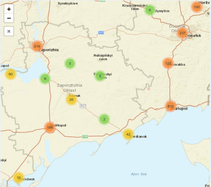
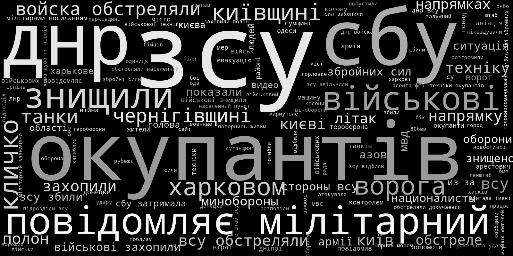
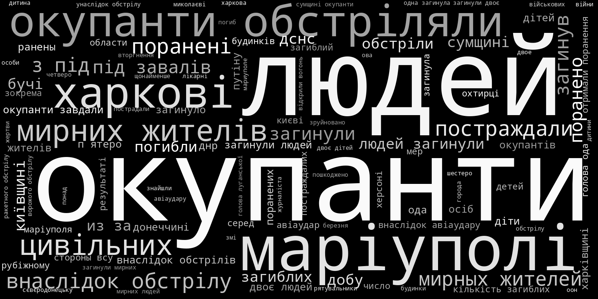

# VIINA / Violent Incident Information from News Articles 
## 2022 Russian Invasion of Ukraine

 (events)

 (territorial control)

VIINA/ВІЙНА/ВОЙНА/WAR is a near-real time multi-source event data system for the 2022 Russian Invasion of Ukraine. These data are based on news reports from Ukrainian and Russian media, which were geocoded and classified into standard conflict event categories through machine learning. 

These data are GIS-ready, with temporal precision down to the minute. Each observation is accompanied by full source information, text and URLs.

In addition to raw events, VIINA also includes data on territorial control, at the level of individual populated places.

VIINA will be updated regularly, and is freely available for use by students, journalists, policymakers, and everyday researchers. 

The most recent versions these data are available as a comma-delimited-text (csv) files here:

- [Data/events_latest.csv](https://github.com/zhukovyuri/VIINA/tree/master/Data/events_latest.csv)
- [Data/control_latest.csv](https://github.com/zhukovyuri/VIINA/tree/master/Data/control_latest.csv)

Previous versions are available here:

- [Data/PreviousVersions/events_[YYYYMMDDHHMMSS].csv](https://github.com/zhukovyuri/VIINA/tree/master/Data/PreviousVersions)
- [Data/PreviousVersions/control_[YYYYMMDDHHMMSS].csv](https://github.com/zhukovyuri/VIINA/tree/master/Data/PreviousVersions)

where "YYYYMMDDHHMMSS" is a time stamp (e.g. 202202240001 is "00:01, February 24, 2022").

Please cite these data as:

 - Zhukov, Yuri (2022). "VIINA: Violent Incident Information from News Articles on the 2022 Russian Invasion of Ukraine." Ann Arbor: University of Michigan, Center for Political Studies. ([https://github.com/zhukovyuri/VIINA](github.com/zhukovyuri/VIINA), accessed [DATE]).

Corrections, feedback welcome: 

Yuri M. Zhukov. Associate Professor of Political Science, University of Michigan. 
Research Associate Professor, Center for Political Studies, Institute for Social Research.
zhukov-at-umich-dot-edu. [sites.lsa.umich.edu/zhukov](http://sites.lsa.umich.edu/zhukov).

## Interactive Map

To select and read individual event reports by location and time, please take a look at the dashboard developed by Robert McGrath and Eric McGlinchey at the Schar School of Policy and Government at George Mason University:

- [go.gmu.edu/ukraine](https://go.gmu.edu/ukraine)

Many thanks to Rob and Eric for getting this dashboard up and running!

## Data Sources

**VIINA** draws on news reports from the following Ukrainian and Russian news providers:

- [24 Канал](https://24tv.ua/) ("24tvua"): Ukrainian 24 hour news network
- [Forbes Ukraine](https://forbes.ua/) ("forbesua"): Ukrainian edition of Forbes magazine
- [Інтерфакс-Україна](https://interfax.com.ua/) ("interfaxua"): Ukrainian affiliate of Russia's Interfax news wire service
- [Комсомольская Правда](https://www.kp.ru/) ("kp"): Russian newspaper
- [ЛІГА.net](https://www.liga.net/) ("liga"): Ukrainian internet news service       
- [Мілітарний](https://mil.in.ua/uk/) ("militarnyy"): Ukrainian defense news portal
- [Медиазона](https://zona.media/) ("mz"): Russian news portal
- [НВ](https://nv.ua/ukr?utm_content=set_lang) ("nv"): Ukrainian magazine and internet news portal
- [Независимая Газета](https://www.ng.ru/news/) ("ng"): Russian newspaper
- [НТВ](https://www.ntv.ru/novosti/) ("ntv"): Russian television news
- [Українська правда](https://www.pravda.com.ua/) ("pravdaua"): Ukrainian newspaper
- [РИА Новости](https://ria.ru/) ("ria"): Russian news wire service
- [УНІАН](https://www.unian.info/) ("unian"): Ukrainian news wire service

To be added soon: 

- Event reports from OSINT social media feeds.

This set of sources may expand/change as the war unfolds -- due to interruptions to journalistic activity from military operations, cyber attacks, and state censorship, as well as the availability of new data from other information providers.

Using an automated web scraping routine (which runs every 6 hours), VIINA extracts the text of news reports published by each source and their associated metadata (publication time and date, web urls). Using natural language processing, the system extracts and geocodes location names mentioned in each news item. A recurrent neural network then classifies each event report into several pre-defined categories.

## Geocoding

Events were geo-located by place names mentioned in the text of each news report, using APIs from Yandex and OpenStreetMaps. All unique geocoded locations were manually inspected for false positive and false negative matches.

Geocoding precision ranges from street-level (GEO_PRECISION="STREET") to province-level (GEO_PRECISION="ADM1").

Below is a map of **all** geocoded event reports since the start of Russia's military operations on February 24, 2022. Underneath the map is a timeline, showing the number of event reports published per hour, across all data sources.

Below are a map and timeline, showing the subset of **war-related** geocoded event reports (i.e. t_mil_b == 1, see below for details).

## Event classification

To generate predicted event categories, VIINA uses a recurrent neural network (RNN) model with long short-term memory (LSTM) ([Hochreiter and Schmidhuber, 1997](https://doi.org/10.1162/neco.1997.9.8.1735); [Chang and Masterson, 2020](https://doi.org/10.1017/pan.2019.46)). LSTMs are well-suited for learning problems related to sequential data, such as sequences of words of differential length, where the vocabulary is potentially large, and where the long-term context and dependencies between inputs are potentially informative for classification (i.e. where word order and context matters, and the bag-of-words assumption is problematic). 

The current version of the data uses a training set of 2000+ randomly-selected hand-coded texts. This training set will be updated/expanded periodically as more and different types of events are added to the text corpus.

Estimation was done in Python with the Keras library.

The data currently include the following event categories:

- t_mil: Event is about war/military operations
- t_nmil: Event is not about war/military operations (e.g. human interest story)
- t_loc: Event report includes reference to specific location
- t_san: Event report mentions economic sanctions imposed on Russia
- a_rus: Event initiated by Russian or Russian-aligned armed forces
- a_ukr: Event initiated by Ukrainian or Ukrainian-aligned armed forces
- a_civ: Event initiated by civilians
- a_other: Event initiated by a third party (e.g. U.S., EU, Red Cross)
- t_aad: Anti-air defense, Buk, shoulder-fired missiles (Igla, Strela, Stinger)
- t_airstrike: Air strike, strategic bombing, helicopter strike
- t_armor: Tank battle or assault
- t_arrest: Arrest by security services or detention of prisoners of war
- t_artillery: Shelling by field artillery, howitzer, mortar, or rockets like Grad/BM-21, Uragan/BM-27, other Multiple Launch Rocket System (MRLS)
- t_control: Establishment/claim of territorial control over population center
- t_firefight: Any exchange of gunfire with handguns, semi-automatic rifles, automatic rifles, machine guns, rocket-propelled grenades (RPGs)
- t_ied: Improvised explosive device, roadside bomb, landmine, car bomb, explosion 
- t_raid: Assault/attack by paratroopers or special forces, usually followed by a retreat
- t_occupy: Occupation of territory or building
- t_property: Destruction of property or infrastructure
- t_milcas: Event report mentions military casualties
- t_civcas: Event report mentions civilian casualties

This set of categories will expand in the future, as more and different types of events are added to the text corpus.

There are two versions of each variable included in the dataset:

1. Predicted probabilities (ending with "\_pred"): predicted probability that event belongs to each category, from the LSTM model
2. Binary indicators (ending with "\_b"): dummy variables, coded 1 or 0

Cutoffs for dichotomizing the predicted probabilities were selected by minimizing Type I and Type II errors against the training set. For each variable, the algorithm considers every potential cutoff ranging from 0 to 1, compares the resulting binary values to training set labels, calculates rates of false positives and false negatives, and selects the cutoff that minimizes the sum of these rates. These cutoffs are different for each variable, and are enumerated in the table below.

Below are in-sample prediction accuracy statistics for each variable (auc: area under the ROC curve, fitted values against training set labels), along with the number of events with probabilities greater than .10 (n_p10) and greater than .90 (n_p90). Also included are recommended cutoffs for dichotomizing each variable (cutoff_01).

|variable         |       auc| n_p10| n_p90| cutoff_01|
|:----------------|---------:|-----:|-----:|---------:|
|a_rus_pred       | 0.9751907| 12092| 10408| 0.9989990|
|a_ukr_pred       | 0.9442675|  9212|  5262| 0.9959960|
|a_civ_pred       | 0.7496665|   216|   170| 0.0120102|
|a_other_pred     | 0.9564300|  5435|  4110| 0.4984981|
|t_aad_pred       | 0.5287158|   318|   309| 0.0380378|
|t_airstrike_pred | 0.9823753|  1927|  1912| 0.9969970|
|t_armor_pred     | 0.6968550|   226|   181| 0.3143143|
|t_arrest_pred    | 0.9315047|  1140|  1125| 0.0020020|
|t_artillery_pred | 0.9739413|  6827|  6752| 0.0010010|
|t_civcas_pred    | 0.9536059|  3761|  3583| 0.1021021|
|t_control_pred   | 0.8868417|  1528|   829| 0.1101100|
|t_firefight_pred | 0.8071284|   720|   686| 0.0130130|
|t_ied_pred       | 0.8429794|   439|   359| 0.1091091|
|t_killing_pred   | 0.5585504|   709|    53| 0.8512725|
|t_loc_pred       | 0.9688827| 32618| 27388| 0.2842845|
|t_mil_pred       | 0.9860245| 46669| 36434| 0.3763778|
|t_milcas_pred    | 0.9468081|  2520|  2360| 0.9419419|
|t_occupy_pred    | 0.6835840|   113|    95| 0.0090077|
|t_property_pred  | 0.6261315|  1830|  1440| 0.9699700|
|t_raid_pred      | 0.7954043|   621|   589| 0.0110110|
|t_san_pred       | 0.9661915| 12969| 12703| 0.9969970|

This table is updated daily and is available in csv format here: 

- [auc_latest.csv](https://github.com/zhukovyuri/VIINA/tree/master/Diagnostics/auc_latest.csv)

Note that these statistics are subject to change, as new events are added to the corpus and as the training set expands.

Below are illustrative word clouds for several categories of events. The font size is proportional to word frequencies in news wire headlines predicted as being most likely to belong to each topic category (99th percentile of predicted probability). The clouds are for out-of-sample predictions on the full set of news stories in the corpus. 

### Events about war/military operations (t_mil_pred)

A quick guide to what some the words mean:

- "окупанти" (okupanty) means "occupiers" (in Ukrainian)
- "зсу" (zsu) is the acronym for Armed Forces of Ukraine (in Ukrainian)

### Russian-initiated events (a_rus_pred)

- "окупанти" (okupanty) means "occupiers" 
- "ворог" (voroh) means "enemy"
- "війска" (viyska) means "forces"

### Ukrainian-initiated events (a_ukr_pred)

- "зсу" (zsu) is the acronym for Armed Forces of Ukraine (in Ukrainian)
- "всу" (vsu) is the acronym for Armed Forces of Ukraine (in Russian)
- "заявили днр" (zayavili dnr) means "DNR has claimed" (in Russian)

### Sanctions (t_san_pred)

- "санкції" (sanktsiyi) means "sanctions"
- "сша" (ssha) means USA
- there are also terms here for sanctions related to SWIFT, Visa, MasterCard

### Anti-air defense (t_aad_pred)

- "збили" (zbyly) means "shot down"
- "літак" (litak) means "aircraft"

### Air strikes (t_airstrike_pred)

- "повітряна тривога" (povitryana tryvoha) means "air raid alert"

### Arrests or detentions of POWs (t_arrest_pred)

- "затримали" (zatrymaly) means "arrested" or "detained"
- "взяли в полон" (vzyaly v polon) means "taken prisoner"

### Tank battles (t_armor_pred)

- "танки" (tanki) means "tanks"
- "окупантів" (okupantiv) means "of occupiers"

### Territorial control (t_control_pred)

- "голова ода" (holova oda) means "head of regional administration" (such officials sometimes make announcements about territorial control)
- "місто" (misto) means "city"
- "контролем" (kontrolem) means "[under] control"

### Firefights (t_firefight_pred)

- "бої" (boyi) means "fighting" (in Ukrainian)
- "бои" (boi) means "fighting" (in Russian)

### Artillery shelling and rocket strikes (t_artillery_pred)

- "обстріл" (obstril) means "shelling"
- "ракети" (rakety) means "rockets"
- "заявили днр" (zayavili dnr) means "DNR has claimed" (i.e. allegations of shelling by UA forces in Donbas)

### Raid (t_raid_pred)

- "наступ" (nastup) means "advance/offensive"
- "діверсантів" (diversantiv) means "of saboteurs/diversionary units"
- "висадився десант" (vysadyvsya desant) means "paratroopers landed"

### Military casualties (t_milcas_pred)

- "понад" (ponad) means "more than"
- "втрати" (vtraty) means "losses"
- "окупантів" (okupantiv) means "of occupiers"
- "загинули" (zahynuly) means "died"

### Civilian casualties (t_civcas_pred)

- "поранені" (poraneni) means "wounded"
- "людей" (lyudey) means "people"
- "дітей" (ditey) means "children"
- "цивільних" (tsyvil'nykh) means "civilian"

## Codebook

- event_id: Unique event ID
- report_id: Unique ID for report that contains the event
- location: Index of unique locations mentioned in each event
- tempid: Temporary numeric ID
- source: Data source short name
- date: Date of event report (YYYYMMDD)
- time: Time of event report (HH:MM)
- url: URL web address of event report
- text: Text of event report headline/description
- lang: Language of report (ua is Ukrainian, ru is Russian)
- address: Address of geocoded location
- longitude: Longitude coordinate of event location
- latitude: Latitude coordinate of event location
- GEO_PRECISION: geographic precision of geocoded location
- GEO_API: Geocoding API used to locate event
- t_[event type]: Predicted probability that report describes event of each type (from LSTM model, see above)
- a_[actor]: Predicted probability that report describes event initiated by each actor (from LSTM model, see above)

## Territorial control

VIINA data on territorial control are built on a manually curated subset of the above event reports, indicating whether each district administrative center (райцентр) or other major city is presently under the control of Ukrainian forces, Russian forces, or is being actively contested between the two. Control status for all other (smaller) populated places is interpolated using the status of the geographically nearest administrative center.

The full set of Ukrainian populated places (N = 33,156) includes all locations in the [GeoNames gazetteer](https://www.geonames.org/) with feature_code's beginning in PPL\*.

Each territorial control dataset includes the following fields:

- geonameid: Numeric ID of populated place
- name: Name of populated place
- asciiname: Name of populated place, ASCII values
- alternatenames: Alternative spellings of place name
- longitude: Longitude coordinate of populated place
- latitude: Latitude coordinate of populated place          
- feature_code: Type of populated place (see [full list here](https://www.geonames.org/export/codes.html))
- ctr_[YYYYMMDDHHMMSS]: Control status, with timestamp (UA/RU/CONTESTED)

Note that the timestamp reflects the time at which the relevant data were collected (typically every six hours or so), which naturally lags behind the reality on the ground.

Territorial control data are presently missing for the following dates: 2022/02/24-2022/02/26, 2022/03/06-2022/03/07. Data for these dates will be retroactively added in future updates.

