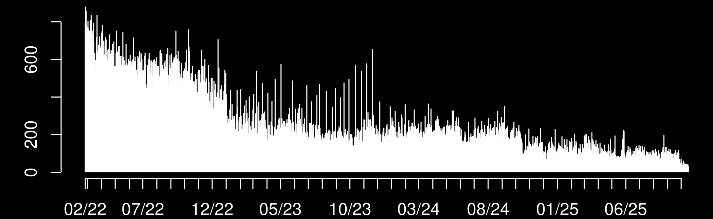
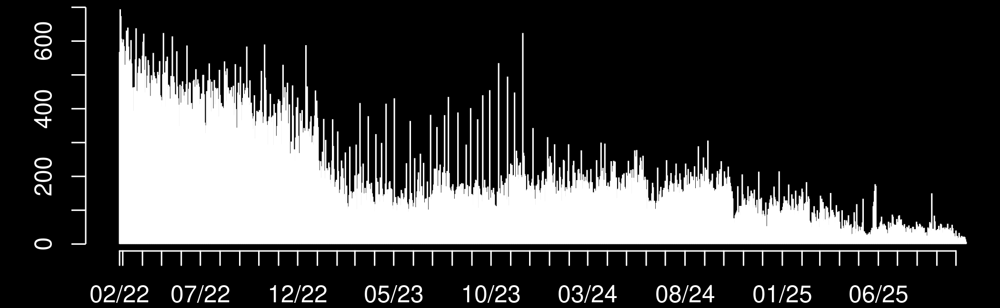
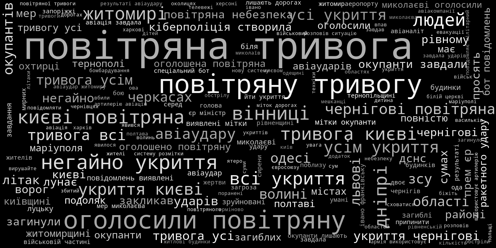
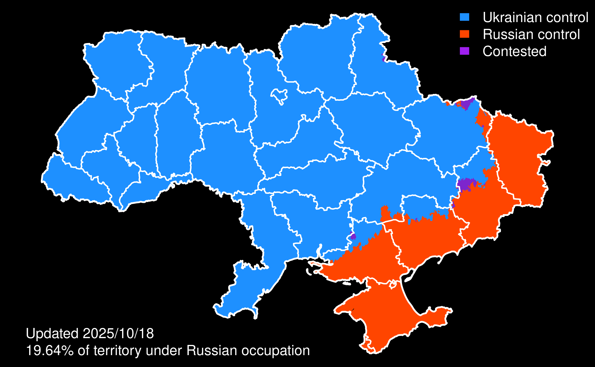

# VIINA 2.0 / Violent Incident Information from News Articles 
## 2022 Russian Invasion of Ukraine

 (territorial control)

 (events)

VIINA/ВІЙНА/ВОЙНА/WAR 2.0 is a near-real time multi-source event data system for the 2022 Russian Invasion of Ukraine. These data are based on news reports from Ukrainian and Russian media, which were geocoded and classified into standard conflict event categories through machine learning. In addition to raw events, VIINA also includes data on territorial control, at the level of individual populated places.

These data are GIS-ready, with temporal precision down to the minute. Each observation is accompanied by full source information, text and URLs.

VIINA is updated daily, and is freely available for use by students, journalists, policymakers, and everyday researchers. 

The most recent versions these data are available as a comma-delimited-text (csv) files within the following compressed ZIP archives:

- [Data/event_info_latest.zip](https://github.com/zhukovyuri/VIINA/tree/master/Data/event_info_latest.zip) | Raw event reports (locations, dates, urls, headlines)
- [Data/event_labels_latest.zip](https://github.com/zhukovyuri/VIINA/tree/master/Data/event_labels_latest.zip) | Event reports labeled by actor and tactic (from LSTM model)
- [Data/event_1pd_latest.zip](https://github.com/zhukovyuri/VIINA/tree/master/Data/event_1pd_latest.zip) | De-duplicated event reports and labels ("one-per-day" filter)
- [Data/control_latest.zip](https://github.com/zhukovyuri/VIINA/tree/master/Data/control_latest.zip) | Territorial control status

Note that each event data release includes both raw event reports (`event_info`, `event_labels`) and a simplified, de-duplicated data file (`event_1pd`). The latter uses a "one-per-day" filter to remove potential duplicate event reports, by treating multiple event reports of the same type (i.e. same combination of actor and tactic labels) in the same populated place on the same day as a single unique event.

Previous data versions are available by request (email me).

Also included are tessellated geometries of Ukrainian populated places (N = 33,141), which were used to create some of the maps on this site. These can be matched to the territorial control data by the variable `geonameid`:

- [Data/gn_UA_tess.geojson](https://github.com/zhukovyuri/VIINA/tree/master/Data/gn_UA_tess.geojson)

For additional information on VIINA (1.0) and illustrative analyses, see:

 - Zhukov, Yuri (2023). "Near-Real Time Analysis of War and Economic Activity during Russia’s Invasion of Ukraine." *Journal of Comparative Economics* ([doi.org/10.1016/j.jce.2023.06.003](https://doi.org/10.1016/j.jce.2023.06.003)). Offprint [available here](https://zhukovyuri.github.io/files/2023_Zhukov_JCE.pdf).

Please cite VIINA 2.0 data as:

 - Zhukov, Yuri and Natalie Ayers (2023). "VIINA 2.0: Violent Incident Information from News Articles on the 2022 Russian Invasion of Ukraine." Cambridge, MA: Harvard University. ([https://github.com/zhukovyuri/VIINA](github.com/zhukovyuri/VIINA), accessed [DATE]).

Corrections, feedback welcome: 

Yuri M. Zhukov. Visiting Associate Professor of Public Policy, Harvard Kennedy School. yzhukov-at-hks-dot-harvard-dot-edu. [zhukovyuri.github.io](https://zhukovyuri.github.io).

## Data Sources

**VIINA 2.0** draws on news reports from the following Ukrainian and Russian news providers:

- [24 Канал](https://24tv.ua/) ("24tvua"): Ukrainian 24 hour news network
- [Espreso TV](https://espreso.tv/) ("espreso"): Ukrainian Internet TV station
- [Forbes Ukraine](https://forbes.ua/) ("forbesua"): Ukrainian edition of Forbes magazine
- [Інтерфакс-Україна](https://interfax.com.ua/) ("interfaxua"): Ukrainian affiliate of Russia's Interfax news wire service
- [Комсомольская Правда](https://www.kp.ru/) ("kp"): Russian newspaper
- [ЛІГА.net](https://www.liga.net/) ("liga"): Ukrainian internet news service       
- [Live Universal Awareness Map](https://liveuamap.com/) ("liveuamap"): Ukrainian conflict event mapping service       
- [Мілітарний](https://mil.in.ua/uk/) ("militarnyy"): Ukrainian defense news portal
- [Медиазона](https://zona.media/) ("mz"): Russian news portal
- [Медуза](https://meduza.io/) ("meduza"): Russian news portal
- [НВ](https://nv.ua/ukr?utm_content=set_lang) ("nv"): Ukrainian magazine and internet news portal
- [Независимая Газета](https://www.ng.ru/news/) ("ng"): Russian newspaper
- [НТВ](https://www.ntv.ru/novosti/) ("ntv"): Russian television news
- [Українська правда](https://www.pravda.com.ua/) ("pravdaua"): Ukrainian newspaper
- [РИА Новости](https://ria.ru/) ("ria"): Russian news wire service
- [УНІАН](https://www.unian.info/) ("unian"): Ukrainian news wire service

This set of sources may expand/change as the war unfolds -- due to interruptions to journalistic activity from military operations, cyber attacks, and state censorship, as well as the availability of new data from other information providers.

Using an automated web scraping routine (which runs every 6 hours), VIINA extracts the text of news reports published by each source and their associated metadata (publication time and date, web urls). Using natural language processing, the system extracts and geocodes location names mentioned in each news item. A neural network model then classifies each event report into several pre-defined categories.

## Geocoding

Events were geo-located by place names mentioned in the text of each news report, using APIs from Yandex and OpenStreetMaps. All unique geocoded locations were manually inspected for false positive and false negative matches.

Geocoding precision ranges from street-level (`GEO_PRECISION="STREET"`) to province-level (`GEO_PRECISION="ADM1"`).

Below is a map of **all** geocoded event reports since the start of Russia's military operations on February 24, 2022. Underneath the map is a timeline, showing the number of event reports published per day, across all data sources.

Here is the subset of events under the category of "military operations" (`t_mil_b=1`):

Here are the same data, after passing through a "one-per-day" filter to remove potential duplicates (`event_1pd_latest.csv`):

 (all event types, one-per-day filter)
 (reports about military operations, one-per-day filter)

## Event classification

The data currently include the following event categories:

- `t_mil`: Event is about war/military operations
- `t_loc`: Event report includes reference to specific location
- `t_san`: Event report mentions economic sanctions imposed on Russia
- `a_rus`: Event initiated by Russian or Russian-aligned armed forces
- `a_ukr`: Event initiated by Ukrainian or Ukrainian-aligned armed forces
- `a_civ`: Event initiated by civilians
- `a_other`: Event initiated by a third party (e.g. U.S., EU, Red Cross)
- `t_aad`: Anti-air defense, Buk, shoulder-fired missiles (Igla, Strela, Stinger)
- `t_airstrike`: Air strike, strategic bombing, helicopter strike
- `t_airalert`: Air raid siren/alert
- `t_armor`: Tank battle or assault
- `t_arrest`: Arrest by security services or detention of prisoners of war
- `t_artillery`: Shelling by field artillery, howitzer, mortar, or rockets like Grad/BM-21, Uragan/BM-27, other Multiple Launch Rocket System (MRLS)
- `t_control`: Establishment/claim of territorial control over population center
- `t_firefight`: Any exchange of gunfire with handguns, semi-automatic rifles, automatic rifles, machine guns, rocket-propelled grenades (RPGs)
- `t_ied`: Improvised explosive device, roadside bomb, landmine, car bomb, explosion 
- `t_raid`: Assault/attack by paratroopers or special forces, usually followed by a retreat
- `t_occupy`: Occupation of territory or building
- `t_property`: Destruction of property or infrastructure
- `t_cyber`: Cyber operations, including DDOS attacks, website defacement
- `t_hospital`: Attacks on hospitals and humanitarian convoys
- `t_milcas`: Event report mentions military casualties
- `t_civcas`: Event report mentions civilian casualties

VIINA 2.0 uses a BERT-based transformer model ([Devlin, et al., 2018](https://doi.org/10.48550/arXiv.1810.04805)) to classify news headlines into the above event categories. Transformers, first developed by Google in 2017, are a class of neural networks that can provide significant performance and efficiency gains over previous generations of recurrent neural networks (RNNs) and convolutional neural networks (CNNs) by using attention, which tracks relationships between elements of the data and enabling significant parallelization. One high-performing and widely-utilized transformer model is Bidirectional Encoder Representations from Transformers (BERT), developed by Google in 2018. This model uses only transformer encoder layers, whereas other models make use of both encoders and decoders, or only decoders. 

We employ an iteration of the BERT-base model, pre-trained using 12 transformer layers, 110 million parameters, and 3.3 billion words. Specifically, we use [KoichiYasouka's bert-base-slavic-cyrillic-upos model](https://huggingface.co/KoichiYasuoka/bert-base-slavic-cyrillic-upos), an iteration of the [ruBERT](https://huggingface.co/ai-forever/ruBert-base)-base model trained on Belarusian, Bulgarian, Russian, Serbian, and Ukrainian texts for part-of-speech tasks. We fine-tune this model for classification using a labeled random subset of the Ukrainian and Russian news headlines scraped for VIINA and use the resulting fully-trained model to categorize all VIINA headlines. 

The previous version of VIINA (1.0) used an RNN model with long short-term memory (LSTM) ([Hochreiter and Schmidhuber, 1997](https://doi.org/10.1162/neco.1997.9.8.1735)). LSTMs are well-suited for learning problems related to sequential data, such as sequences of words of differential length, where the vocabulary is potentially large, and where the long-term context and dependencies between inputs are potentially informative for classification (i.e. where word order and context matters, and the bag-of-words assumption is problematic). 

Below is a comparison of out-of-sample classification accuracy statistics --- areas under the Receiver-Operator Characteristic (AUC ROC) curves --- for the BERT (`roc_bert`) and LSTM (`roc_lstm`) models. These statistics can be interpreted as the probability that the model assigns a higher predicted probability to a randomly chosen event (e.g. `t_mil=1`) than to a randomly chosen non-event (e.g. `t_mil=0`). An AUC of 1 indicates perfect out-of-sample accuracy. An AUC of 0.50 indicates that a model performs no better than random classification. AUCs can be particularly useful in evaluating predictive performance for categories with high class imbalance (i.e. rare events, with a lot of 0's and very few 1's).  

As the table suggests, BERT universally dominates LSTM on this metric:

|variable    | support|  roc_bert|  roc_lstm|
|:-----------|-------:|---------:|---------:|
|t_mil       |     137| 0.9510229| 0.8985504|
|t_loc       |     105| 0.9799434| 0.9216439|
|t_san       |      35| 0.8817756| 0.4954361|
|a_rus       |      50| 0.9491855| 0.8020814|
|a_ukr       |      29| 0.9323006| 0.8054666|
|a_civ       |       3| 0.8302658| 0.7634628|
|a_other     |      20| 0.8152542| 0.6826271|
|t_aad       |       2| 1.0000000| 0.5346939|
|t_airstrike |       4| 0.9390369| 0.5030738|
|t_arrest    |       8| 0.9857955| 0.5010331|
|t_artillery |      34| 0.9915875| 0.9021320|
|t_control   |       5| 0.9075975| 0.5051335|
|t_firefight |       3| 0.9727335| 0.5051125|
|t_ied       |       4| 1.0000000| 0.9659324|
|t_property  |      11| 0.9293139| 0.8571159|
|t_raid      |       1| 0.9959267| 0.5885947|
|t_occupy    |       1| 1.0000000| 0.5030550|
|t_cyber     |      11| 1.0000000| 0.8941599|
|t_milcas    |       9| 0.9878077| 0.7786980|
|t_civcas    |      13| 0.9991970| 0.5052192|
|t_retreat   |       1| 0.9918534| 0.4949084|
|t_airalert  |       5| 0.8078029| 0.7219713|

As a general rule of thumb, we urge users of VIINA data to avoid variables for which the out-of-sample AUC is less than 0.80. Some additional caution is warranted here, since the randomly-selected data sample used to evaluate out-of-sample predictive accuracy has limited positive examples for some variables (e.g. `t_raid` and `t_occupy` each have only one positive instance in this table). 

While VIINA 1.0 will no longer be updated, the most recent version is available in archived form here:
- [Data/PreviousVersions/event_info_latest_v1.zip](https://github.com/zhukovyuri/VIINA/tree/master/Data/PreviousVersions/event_info_latest_v1.zip) | Raw event reports (locations, dates, urls, headlines)
- [Data/PreviousVersions/event_labels_latest_v1.zip](https://github.com/zhukovyuri/VIINA/tree/master/Data/PreviousVersions/event_labels_latest_v1.zip) | Event reports labeled by actor and tactic (from LSTM model)
- [Data/PreviousVersions/event_1pd_latest_v1.zip](https://github.com/zhukovyuri/VIINA/tree/master/Data/PreviousVersions/event_1pd_latest_v1.zip) | De-duplicated event reports and labels ("one-per-day" filter)

There are two versions of each variable included in the VIINA dataset:

1. Predicted probability that event belongs to each category, from the BERT model: Floating point, from 0 to 1.
2. Binary indicators (ending with "\_b"): binary integer, coded 0 or 1.

We selected thresholds for dichotomizing the predicted probabilities by maximizing the F~1 score against a pre-labeled (out-of-sample) test set. The F~1 score is equivalent to the harmonic mean of precision and recall, or TP/(TP + 1/2(FP+FN)), where TP is the number of true positives, FP is false positives, and FN is false negatives. For each variable, the algorithm considers every potential cutoff ranging from 0 to 1, compares the resulting binary values to "true" labels, calculates the F~1 score, and selects the cutoff that maximizes this score. These cutoffs are different for each variable, and are enumerated in the table below.

Below are detailed out-of-same prediction accuracy statistics for each variable, along with the cutoffs for dichotomizing each variable (cutoff_01).

|variable    |  f1-score| support|  accuracy|   roc-auc| thresholds|
|:-----------|---------:|-------:|---------:|---------:|----------:|
|t_mil       | 0.8531469|     137| 0.9146341| 0.9510229|      0.955|
|t_loc       | 0.8918919|     105| 0.9512195| 0.9799434|      0.501|
|t_san       | 0.7397260|      35| 0.9613821| 0.8817756|      0.967|
|a_rus       | 0.7346939|      50| 0.9471545| 0.9491855|      0.893|
|a_ukr       | 0.7450980|      29| 0.9735772| 0.9323006|      0.857|
|a_civ       | 0.3636364|       3| 0.9857724| 0.8302658|      0.217|
|a_other     | 0.3888889|      20| 0.9552846| 0.8152542|      0.747|
|t_aad       | 1.0000000|       2| 1.0000000| 1.0000000|      0.075|
|t_airstrike | 0.8571429|       4| 0.9979675| 0.9390369|      0.054|
|t_armor     | 0.0000000|       0| 1.0000000|        NA|      0.500|
|t_arrest    | 0.6363636|       8| 0.9837398| 0.9857955|      0.025|
|t_artillery | 0.8888889|      34| 0.9837398| 0.9915875|      0.045|
|t_control   | 0.6666667|       5| 0.9918699| 0.9075975|      0.017|
|t_firefight | 0.5000000|       3| 0.9959350| 0.9727335|      0.589|
|t_ied       | 1.0000000|       4| 1.0000000| 1.0000000|      0.753|
|t_property  | 0.5714286|      11| 0.9817073| 0.9293139|      0.143|
|t_raid      | 0.5000000|       1| 0.9959350| 0.9959267|      0.065|
|t_occupy    | 1.0000000|       1| 1.0000000| 1.0000000|      0.059|
|t_cyber     | 1.0000000|      11| 1.0000000| 1.0000000|      0.044|
|t_hospital  | 0.0000000|       0| 1.0000000|        NA|      0.500|
|t_milcas    | 0.8000000|       9| 0.9939024| 0.9878077|      0.457|
|t_civcas    | 0.9600000|      13| 0.9979675| 0.9991970|      0.968|
|t_retreat   | 0.2857143|       1| 0.9898374| 0.9918534|      0.005|
|t_airalert  | 0.7500000|       5| 0.9959350| 0.8078029|      0.008|

This table is available in csv format here: 

- [classification_report_bert.csv](https://github.com/zhukovyuri/VIINA/tree/master/Diagnostics/classification_report_bert.csv)

Note that these statistics are subject to change, as new events are added to the corpus and as the training set expands.

Below are illustrative word clouds for several categories of events. The font size is proportional to word frequencies in news wire headlines predicted as being most likely to belong to each topic category (99th percentile of predicted probability). The clouds are for out-of-sample predictions on the full set of news stories in the corpus. 

### Events about war/military operations (t_mil_*)

A quick guide to what some the words mean:

- "окупанти" (okupanty) means "occupiers" (in Ukrainian)
- "зсу" (zsu) is the acronym for Armed Forces of Ukraine (in Ukrainian)

### Russian-initiated events (a_rus_*)

- "окупанти" (okupanty) means "occupiers" 
- "ворог" (voroh) means "enemy"
- "війска" (viyska) means "forces"

### Ukrainian-initiated events (a_ukr_*)

- "зсу" (zsu) is the acronym for Armed Forces of Ukraine (in Ukrainian)
- "всу" (vsu) is the acronym for Armed Forces of Ukraine (in Russian)
- "заявили днр" (zayavili dnr) means "DNR has claimed" (in Russian)

### Sanctions (t_san_*)

- "санкції" (sanktsiyi) means "sanctions"
- "сша" (ssha) means USA
- there are also terms here for sanctions related to SWIFT, Visa, MasterCard

### Anti-air defense (t_aad_*)

- "збили" (zbyly) means "shot down"
- "літак" (litak) means "aircraft"

### Air strikes (t_airstrike_*)

- "повітряна тривога" (povitryana tryvoha) means "air raid alert"

### Arrests or detentions of POWs (t_arrest_*)

- "затримали" (zatrymaly) means "arrested" or "detained"
- "взяли в полон" (vzyaly v polon) means "taken prisoner"

### Tank battles (t_armor_*)

- "танки" (tanki) means "tanks"
- "окупантів" (okupantiv) means "of occupiers"

### Territorial control (t_control_*)

- "голова ода" (holova oda) means "head of regional administration" (such officials sometimes make announcements about territorial control)
- "місто" (misto) means "city"
- "контролем" (kontrolem) means "[under] control"

### Firefights (t_firefight_*)

- "бої" (boyi) means "fighting" (in Ukrainian)
- "бои" (boi) means "fighting" (in Russian)

### Artillery shelling and rocket strikes (t_artillery_*)

- "обстріл" (obstril) means "shelling"
- "ракети" (rakety) means "rockets"
- "заявили днр" (zayavili dnr) means "DNR has claimed" (i.e. allegations of shelling by UA forces in Donbas)

### Raid (t_raid_*)

- "наступ" (nastup) means "advance/offensive"
- "діверсантів" (diversantiv) means "of saboteurs/diversionary units"
- "висадився десант" (vysadyvsya desant) means "paratroopers landed"

### Destruction of property or infrastructure (t_property_*)

- "будинків" (budynkiv) means "houses"
- "з під завалів" (z pid zavaliv) means "from under the rubble"

### Cyber operations (t_cyber_*)

- "хакери" (khakery) means "hackers"
- "зламали сайт" (zlamaly sayt) means "hacked the website"

### Attacks on hospitals (t_hospital_*)

- "лікарні" (likarni) means "hospitals"
- "гуманітарні коридори" (humanitarni korydory) means "humanitarian corridors"
- "працюють" (pratsyuyut') means "are working"

### Military casualties (t_milcas_*)

- "понад" (ponad) means "more than"
- "втрати" (vtraty) means "losses"
- "окупантів" (okupantiv) means "of occupiers"
- "загинули" (zahynuly) means "died"

### Civilian casualties (t_civcas_*)

- "поранені" (poraneni) means "wounded"
- "людей" (lyudey) means "people"
- "дітей" (ditey) means "children"
- "цивільних" (tsyvil'nykh) means "civilian"

## Codebook

Raw event reports ([Data/event_info_latest.zip](https://github.com/zhukovyuri/VIINA/tree/master/Data/event_info_latest.zip))
- `viina_version`: Date and time of VIINA data release
- `event_id`: Unique event ID
- `event_id_1pd`: De-duplicated event ID (from one-per-day filter)
- `date`: Date of event report (YYYYMMDD)
- `time`: Time of event report (HH:MM)
- `geonameid`: Numeric ID of populated place
- `feature_code`: Type of populated place (see [full list here](https://www.geonames.org/export/codes.html))
- `asciiname`: Name of populated place, ASCII values
- `ADM1_NAME`: Name of first-level administrative unit (oblast')
- `ADM1_CODE`: Numerical code of first-level administrative unit (oblast')
- `ADM2_NAME`: Name of second-level administrative unit (rayon)
- `ADM2_CODE`: Numerical code of second-level administrative unit (rayon)
- `longitude`: Longitude coordinate of event location
- `latitude`: Latitude coordinate of event location
- `GEO_PRECISION`: geographic precision of geocoded location
- `GEO_API`: Geocoding API used to locate event
- `location`: Index of unique locations mentioned in each event
- `address`: Address of geocoded location
- `report_id`: Unique ID for report that contains the event
- `source`: Data source short name
- `url`: URL web address of event report
- `text`: Text of event report headline/description
- `lang`: Language of report (ua is Ukrainian, ru is Russian)

Event reports labeled by actor and tactic ([Data/event_labels_latest.zip](https://github.com/zhukovyuri/VIINA/tree/master/Data/event_labels_latest.zip)):
- `viina_version`: Date and time of VIINA data release
- `event_id`: Unique event ID
- `event_id_1pd`: De-duplicated event ID (from one-per-day filter)
- `date`: Date of event report (YYYYMMDD)
- `time`: Time of event report (HH:MM)
- `geonameid`: Numeric ID of populated place
- `t_[event type]`: Predicted probability (and binary indicator) that report describes event of each type (from BERT model, see above)
- `a_[actor]`: Predicted probability (and binary indicator) that report describes event initiated by each actor (from BERT model, see above)

De-duplicated event reports and labels ([Data/event_1pd_latest.zip](https://github.com/zhukovyuri/VIINA/tree/master/Data/event_1pd_latest.zip)):
- `viina_version`: Date and time of VIINA data release
- `event_id_1pd`: De-duplicated event ID (from one-per-day filter)
- `date`: Date of event report (YYYYMMDD)
- `n_reports`: Number of constitutive event reports 
- `event_ids`: IDs of constitutive events (`event_id` in above two files)
- `sources`: Sources for constitutive events (`source` in event_info_latest files)
- `geonameid`: Numeric ID of populated place
- `feature_code`: Type of populated place (see [full list here](https://www.geonames.org/export/codes.html))
- `asciiname`: Name of populated place, ASCII values
- `ADM1_NAME`: Name of first-level administrative unit (oblast')
- `ADM1_CODE`: Numerical code of first-level administrative unit (oblast')
- `ADM2_NAME`: Name of second-level administrative unit (rayon)
- `ADM2_CODE`: Numerical code of second-level administrative unit (rayon)
- `longitude`: Longitude coordinate of event location
- `latitude`: Latitude coordinate of event location
- `GEO_PRECISION`: geographic precision of geocoded location
- `t_[event type]`: Binary indicator for each event type (from BERT model, see above)
- `a_[actor]`: Binary indicator for each actor (from BERT model, see above)

## Territorial control

VIINA data on territorial control are based on three sources: VIINA event reports on territorial control, polygon map layers from DeepStateMap, and crowdsourced control maps from Wikipedia. In cases where the three data sources disagree, a "majority vote" rule is used to determine whether a populated place is under the control of Ukrainian forces, Russian forces, or is being actively contested between the two. 

The full set of Ukrainian populated places (N = 33,156) includes all locations in the [GeoNames gazetteer](https://www.geonames.org/) with feature_code's beginning in PPL\*.

Each territorial control dataset includes the following fields:

- `geonameid`: Numeric ID of populated place
- `date`: Date of map update (YYYYMMDD)
- `status_wiki`: Reported control status (UA/RU/CONTESTED), from Wikipedia crowdsourced maps
- `status_boost`: Reported control status (UA/RU/CONTESTED), from Wikipedia "boosted" by VIINA event reports
- `status_dsm`: Reported control status (UA/RU/CONTESTED), from DeepStateMap
- `status`: Reported control status (UA/RU/CONTESTED), "majority vote" of wiki, boost and dsm 

Note that the structure of these data have recently changed. Starting August 8, 2023, the data files have switched from a "wide" matrix format (rows are populated places, columns are status at different time points) to "long" panel data format (rows are daily observations for each populated place, columns are control status from different sources). Each daily observation uses the most recently available data from each of the three sources.
